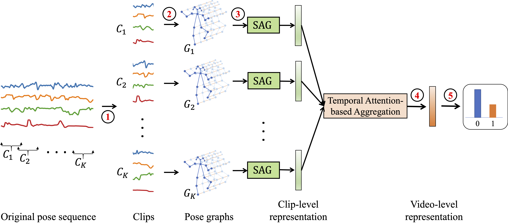

# A Spatio-temporal Attention-based Model for Infant Movement Assessment from Videos

This is the Pytorch implementation of the paper: <a href="https://nguyenthaibinh.github.io/papers/stam_jbhi.pdf" target="_blank">A Spatio-temporal Attention-based Model for Infant Movement Assessment from Videos</a>. *IEEE Journal of Biomedical and Health Informatics (JBHI), 2021*.

Please cite our paper if you find the code, dataset, or the experimental setting useful for your research.
```
@ARTICLE{9425001,
  author={Nguyen-Thai, Binh and Le, Vuong and Morgan, Catherine and Badawi, Nadia and Tran, Truyen and Venkatesh, Svetha},
  journal={IEEE Journal of Biomedical and Health Informatics}, 
  title={A Spatio-temporal Attention-based Model for Infant Movement Assessment from Videos}, 
  year={2021},
  volume={},
  number={},
  pages={1-1},
  doi={10.1109/JBHI.2021.3077957}
}
```

## Overview

<p align="center">

</p>
<p>
  <b>Fig. 1. </b><em>High-level architecture of the proposed model. <b>Step 1</b>: split the pose sequence to overlapping clips. <b>Step 2</b>: construct the pose graph of each clip. <b>Step 3</b>: generate clip-level representations using Spatial Attention Graph Convolutional Network (SAG). <b>Step 4</b>: compute video-level representation using temporal attention. <b>Step 5</b>: make prediction.</em>
</p>

**Abstract**: The absence or abnormality of fidgety movements of joints or limbs is strongly indicative of cerebral palsy in infants. Developing computer-based methods for assessing infant movements in videos is pivotal for improved cerebral palsy screening. Most existing methods use appearance-based features and are thus sensitive to strong but irrelevant signals caused by background clutter or a moving camera. Moreover, these features are computed over the whole frame, thus they measure gross whole body movements rather than specific joint/limb motion.
Addressing these challenges, we develop and validate a new method for fidgety movement assessment from consumer-grade videos using human pose extracted from short clips. Human pose capture only relevant motion profiles of joints and limbs and are thus free from irrelevant appearance artifacts. The dynamics and coordination between joints are modeled using spatio-temporal graph convolutional networks. Frames and body parts that contain discriminative information about fidgety movements are selected through a spatio-temporal attention mechanism. We validate the proposed model on the cerebral palsy screening task using a real-life consumer-grade video dataset collected at an Australian hospital through the Cerebral Palsy Alliance, Australia. Our experiments show that the proposed method achieves the ROC-AUC score of 82%, significantly outperforming existing competing methods with better interpretability.

Requirements
------------
```shell script
mlflow==1.8.0
torchvision==0.6.0
pandas==1.0.4
scikit_video==1.1.11
opencv_python==4.2.0.34
torch==1.6.0
numpy==1.18.4
moviepy==1.0.3
nets==0.0.3
PyYAML==5.3.1
scikit_learn==0.23.2
skvideo==0.1.1

# Install required packages
pip install -r requirements.txt
```

Config data path
----------------------
- The path to your dataset is config in the config.yaml file.

Dataset folder structure
----------------------
    ├── datasets
        ├── estimated_poses
        ├── preprocessed_poses
        ├── pose_sequences
        ├── split
        └── labels.txt

- *estimated_poses*: the folder of extracted pose in .pkl files.
- *preprocessed_poses*: the pose data after being pre-processed.
- *pose_sequences*: pose sequences in tensor format (.npy), which are the input of STAM.
- *split*: train/test split profile
- *labels.txt*: the file containing the labels of the videos.

*Note*: The dataset in this github is not the dataset used in the paper. 
It is a toy dataset which is created to show how to use STAM.  Due to privacy issue, we cannot make our dataset, which is used in the paper, public.

The pose sequence file (raw_skel.npy) format
------------
```
This is a tensor of shape (n_channels, T, n_joints) where:
- n_channels: 7 (number of input feature for each joint)
- T: number of frames
- n_joints:   number of joints
  -  0: x
  -  1: y
  -  2: velocity_x
  -  3: velocity_y
  -  4: acceleration_x
  -  5: acceleration_y
  -  6: displacement
```

Train and validate the model
----------------------
This will load the pose sequences in the folder *pose_sequences*, then train and validate the model.
```shell script
python src/train.py --max-epoch 400
```

Data preparation
----------------------
This is to pre-process the raw pose data, and generate pose sequence (raw_skel.npy) files.

1. Config the path to your data set in config.yaml file.git 
2. Run the following scripts
```shell
bash run_all.sh
```
or
```shell script
# Preprocess pandas files and save to {{ data_root }}/estimated_poses and {{ data_root }}/preprocessed_poses folders
python src/data/preprocess/preprocess_pose_data.py

# Create pose sequences (npy files will be stored in {{ data_root }}/pose_sequences/{{ infant_id }}/raw_skel.npy)
python src/data/preprocess/pkl_pose2npy.py

# Break a long sequences to sub-sequences of length 1000 frames
python src/data/preprocess/create_sub_sequences.py

# Split datasets into folds
python src/data/split_data.py
```
----------------------